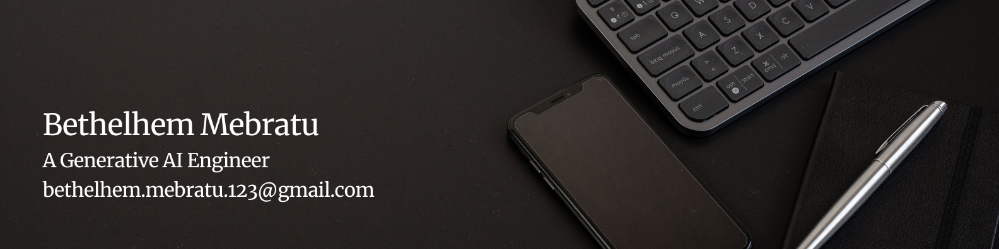

<h1 align="center">Hi there 👋👋,Welcome to my Github Profile</h1>

## I'm Bethelhem Mebratu

I am a Junior Generative AI Engineer and a Machine learning enthusiast. I have a passion of learning and sharing my knowledge.

- 🔭 I’m currently working on improving my Machine Learning and Generative AI Engineering skills
- 🌱 I’m currently learning *machine learning algorithms*
- 📚 In my spare time, I like spending time with loved ones and exploring what's out there.

## 🌐 Socials:
  

# 💻 Tech Stack:
                                  
# 📊 GitHub Stats:

### 🔝 Top Contributed Repo

---

<!-- Proudly created with GPRM ( https://gprm.itsvg.in ) -->

